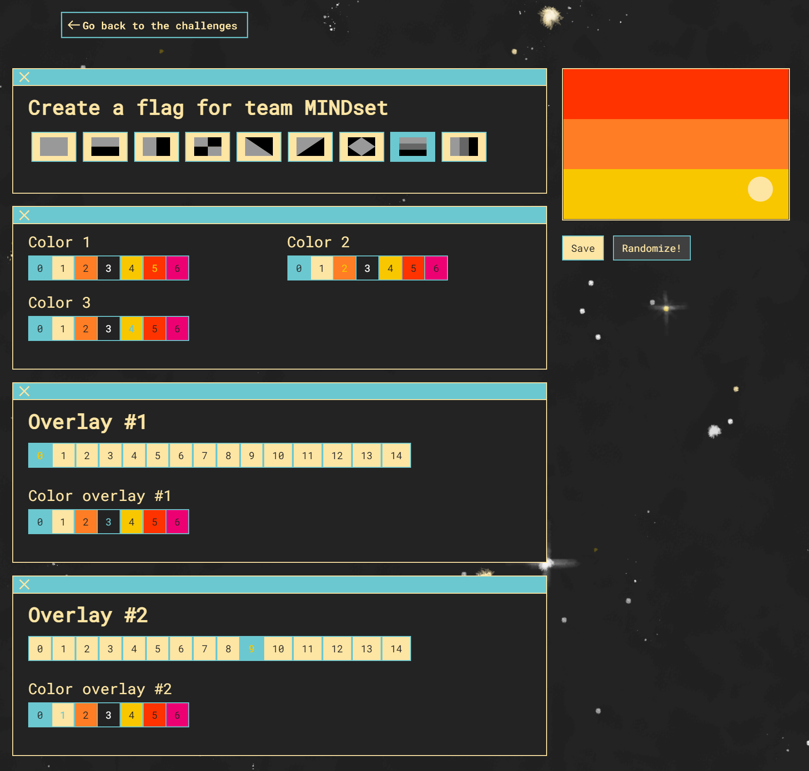
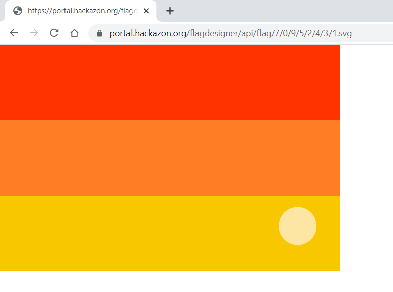
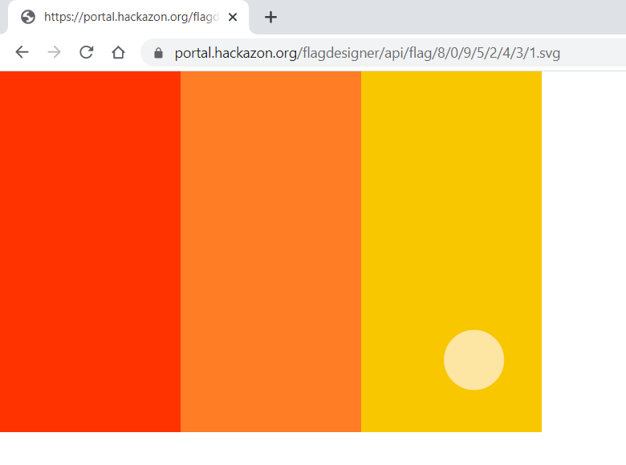
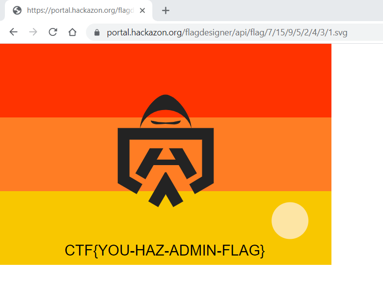

# TEASER: su admin

*web*

## Challenge Information

> You arrived at the launch platform of SPACE RACE. Teams around you are preparing for the event the
> best they can by gathering their crew and designing their flag.
>
> At the outset of the camp you notice the Hacky Holidays admin base, you decide to stake-out and
> see what's happening. After a while you notice that people are only allowed to access the admin
> base when they show the Hacky Holidays admin flag below.

### Additional Resources

`admin_flag.png`


## Tasks

### [50 points] Identify yourself

> Open the flag designer and see if you can hack your way into the admin base.
>
> Note: Only the URL https://portal.hackazon.org/flagdesigner and its sub-URLs are part of the
> teaser challenge.

## Solution

The challenge seems pretty clear, replicate the given flag in the flag designer and that will
somehow provide us with the solution.

We start by getting as close as we can with the following settings:

| Setting          | Value |
| ---------------- | ----- |
| Color 1          | 5     |
| Color 2          | 2     |
| Color 3          | 4     |
| Overlay #1       | 0     |
| Color overlay #1 | 3     |
| Overlay #2       | 9     |
| Color overlay #2 | 1     |

`flag_designer_at_the_limit.png`



Unfortunately, there seems to be no way to get the cool overlay in the center!
It is obvious that we need to take a look at the flag generation and as a first step, we just open
the flag image in a separate browser tab.

`flag_in_browser_original.png`



Lets see what changing the numbers in the URL does....

`flag_in_browser_modified.png`



This is the result of bumping the first numeric parameter 7 up to 8.
Next, we make an educated guess that the parameter which is currently 0 represents "Overlay #1" and
change it to 15, which is out of bounds by 1.

`flag_in_browser_solution.png`



### Flag
```
CTF[YOU-HAZ-ADMIN-FLAG}
```

## Rabbit Holes
None so far, this was as straight forward as it goes.
