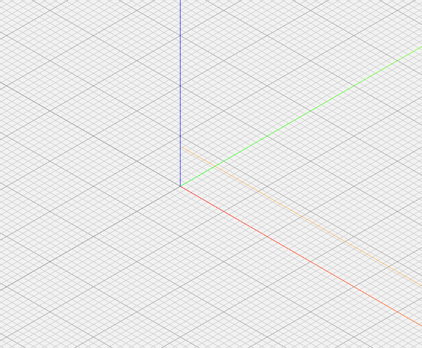
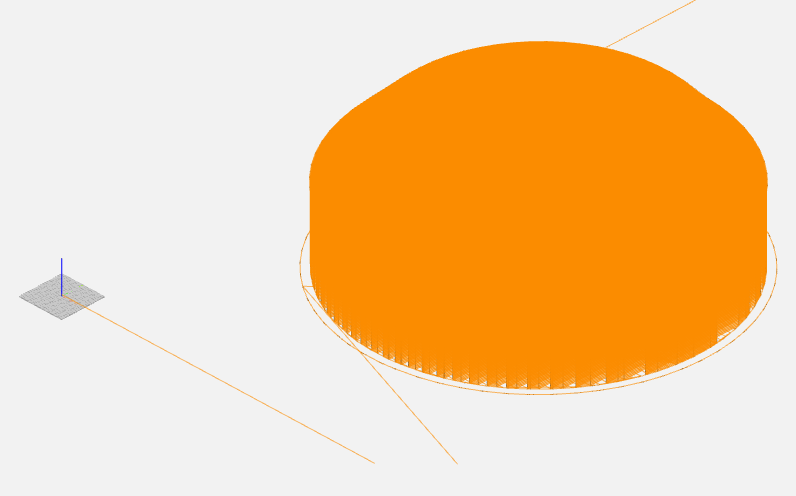
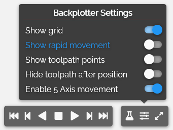
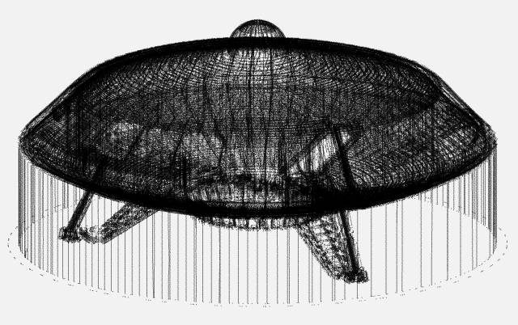
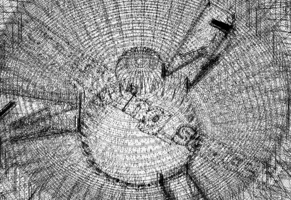
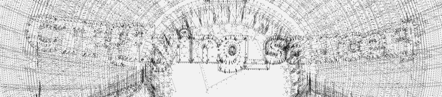

# Unidentifi3d Flying Object

_stego_

## Challenge Information

> We've seen an Unidentifi3d Flying Object passing by. It was created on one of the universe's most
> advanced printers.

### Additional Resources

`unidentifi3d.gcode`

As the file is about 14.6 MB in size, we will only show the first chunk of lines here to help you
better understand the challenge:

```gcode
;FLAVOR:Marlin
;TIME:50173
;Filament used: 84.7082m, 0m
;Layer height: 0.3
;MINX:19.309
;MINY:45.927
;MINZ:0.15
;MAXX:177.321
;MAXY:203.785
;MAXZ:73.05
;Generated with Cura_SteamEngine 4.8.0
T0
M82 ;absolute extrusion mode
;printer start script
G28 ;home
G29
G90 ;absolute positioning
G1 X0 Y0 Z15 E0 F300 ;go to wait position
M140 S60 ;set bed temp
M109 S200 ;set extruder temp and wait
G1 Z0.8 F200 ;set extruder height
G1 X220 Y0 E80 F1000 ;purge line
;end of start script
G92 E0
G92 E0
G1 F2100 E-0.8
;LAYER_COUNT:244
;LAYER:0
M107
G0 F3600 X51.743 Y61.089 Z0.15
;TYPE:SKIRT
G1 F2100 E0
G1 F1800 X52.195 Y60.743 E0.0142
G1 X52.35 Y60.631 E0.01897
G1 X53.29 Y59.998 E0.04724
G1 X58.168 Y56.851 E0.19205
G1 X58.772 Y56.474 E0.20981
G1 X59.221 Y56.222 E0.22265
G1 X59.304 Y56.177 E0.22501
...
```

## Tasks

### [30 points] Printer

> The UFO was forged on one of the universe's most advanced printers - do you know which make and
> model? Enter the answer as `Make Model`.

From the file extension and its content, we can easily conclude that we are dealing with G-code
here. The [corresponding article on Wikipedia](https://en.wikipedia.org/wiki/G-code) explains well what G-code is:

> G-code instructions are provided to a machine controller (industrial computer) that tells the
> motors where to move, how fast to move, and what path to follow. The two most common situations
> are that, within a machine tool such as a lathe or mill, a cutting tool is moved according to
> these instructions through a toolpath cutting away material to leave only the finished workpiece
> and/or, an unfinished workpiece is precisely positioned in any of up to nine axes around the
> three dimensions relative to a toolpath and, either or both can move relative to each other. The
> same concept also extends to noncutting tools such as forming or burnishing tools, photoplotting,
> additive methods such as 3D printing, and measuring instruments.

As the task asks for make and model of a printer, we seem to be in the second use case for G-code.

Looking at the file, we notice the section `printer start script` with some commands probably
required to set up the printer correctly. Maybe we can search for these to find other files on the
Internet that tell us, which printer is used.

A search for _"G1 X0 Y0 Z15 E0 F300" "M140 S60"_ (the first two longer lines) returns exactly one
result: https://forum.simplify3d.com/viewtopic.php?f=9&t=15915

In this thread someone struggles with migrating his startup code from Cura to Simplify3D. His Cura
code is identical to the part of our file and the author indeed describes what hardware he is
using:

> I am using a Geeetech A20M equipped with a BLtouch sensor to auto-level my bed.

Voilà! We got make and model of the printer and our first flag: Geeetech A20M

### [70 points] Layer by Layer

> Do you know how GCode files work? Maybe you can find a hidden message along the layers. Flag
> format: CTF{answer}

Luckily, we do not have to get ourselves a 3D printer to complete this task as there are several
online tools for viewing G-code files. One of them is https://ncviewer.com/ where we can load the
file and it is rendered in the browser. However, after some processing time we are presented with
an empty grid:



Noticing the orange line, we start scrolling and zooming out while following that line.
Finally we find a large orange unknown object:



As the orange thing does not really help us much from ether side, we start changing the plotter
settings:



After disabling the _Show rapid movement_ option the actual object finally reveals:



Moving around a bit, we discover the flag embedded in the bottom surface of the saucer:



To improve the readability, we can only plot the lower part of the object. By click somewhere in
the middle of the G-code file and disabling the _Hide toolpath after position_ option, the flag
`CTF{flying_saucer}` becomes much clearer:


