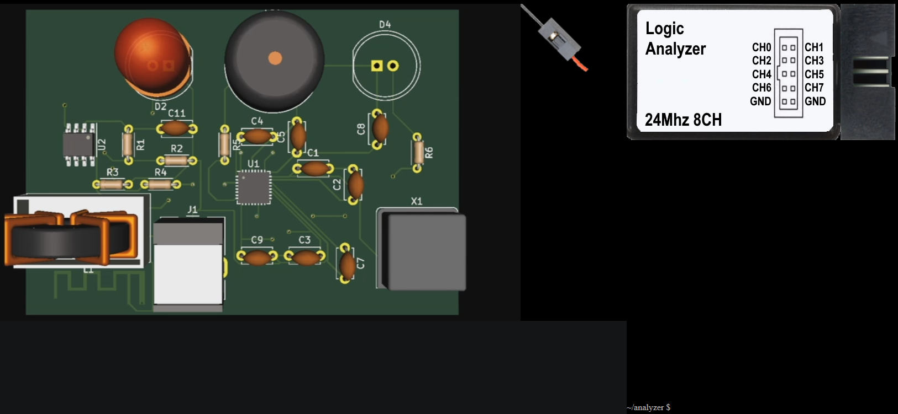
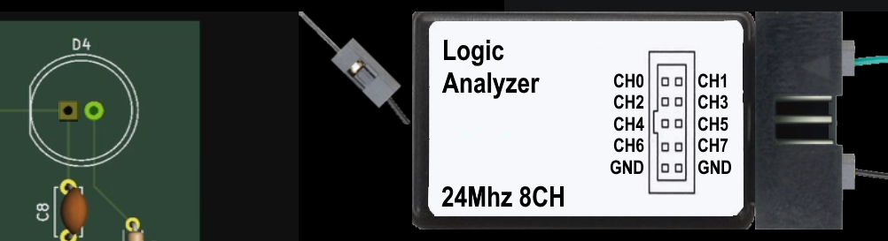
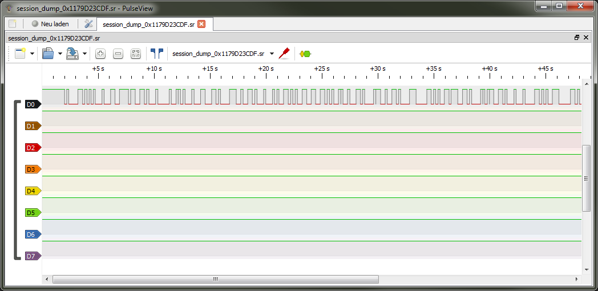
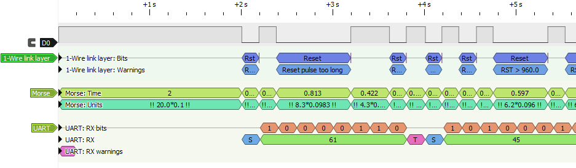
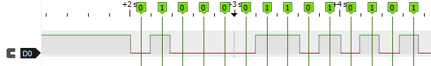
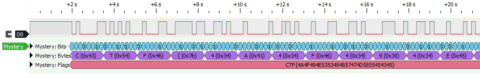
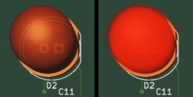
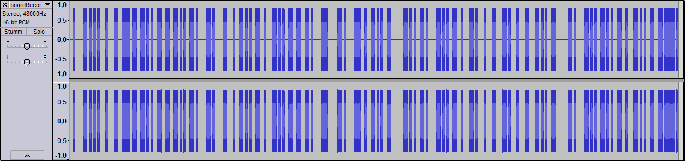

# Mystery Beacon

## Challenge Information

> We've found this piece of hardware next to a rocket. Time to investigate!

### Additional Resources

A link to the shared website https://mysterybeacon.challenge.hackazon.org/ presents us a tutorial screen with the following text:

> This is the tutorial screen for this challenge.
>
> This is a hardware hacking challenge, which means you will have to interact with devices that act
> like the physical ones.
>
> This challenge uses pop-ups, so make sure they aren't blocked.
>
> You can click on certain parts of the tools to interact with them (for example the ports at the
> right of the logic analyzer).
>
> Some tools can blow up if used improperly, you can only reset them by reloading the page.
>
> Some tools have a terminal below them. You can type in these terminals by clicking anywhere in
> the terminal, which will highlight the textbox.
>
> You can change with which cable you are probing the board by pressing the probe between the tool
> and the PCB.
>
> Good luck hackers, let's see what secrets this board has in store for us!
>
> (click anywhere to dismiss)

So let's see that we don't blow anything up! After dismissing the message, we are faced with the
following screen:


On the left we have the virtual PCB. It contains many electronic parts under which there are a
blinking LED, a buzzer that can be heard on the audio and a space left by an unpopulated component
with two pins. On the right side of the screen there is the virtual logic analyzer with a probe
besides it and a terminal window below.

## Tasks

### [75 points] Analyze

> It seems a component was destroyed while handling the board. If only there was a
> way to see what it was for...  
> Hint: It seems not only the board was messed up, but the flag as well.
> The flag format is CTF{32 hex}.

Partly having a background in electrical engineering we are instantly drawn to the logic analyzer
and start clicking around with the probe. As it turns out the probe can only be connected the two
pins for the unpopulated component on the right side of the PCB.

Clicking on the the probe besides the logic analyzer switches to the next of five available probes
(green, yellow, red, blue, black). As told by the tutorial screen, clicking on the ports on the
ride side of the analyzer connects or disconnects probes to the analyzer. Here we connect one
arbitrary (green) and the black probe. Having worked with a real-world logic analyzer, we assume
the black probe to be the ground connection for the analyzer.

The left pin of the unpopulated component is shared with the buzzer by a PCB trace. We therefore
concluded this would be the ground pin and connect the black probe to it. For the other pin we
select the green probe and create a connection as well.


Now over to the terminal of the analyzer, that does not seems to be of much help:

```
~/analyzer $help

Command not found
```

At least it is able to provide a list of its commands:

```
~/analyzer $ls

analyze.sh

~/analyzer $./analyze.sh

Communication found! Creating dump...
```

After shown a nice animation of a logic analyzer capturing data, we are provided with a file
download of the dump called `session_dump_0x1179D23CDF.sr`. An Internet search for the file type
`.sr` leads us to https://sigrok.org/ where analysis software `PulseView` can be downloaded.
Using the software we get at nice view of the recorded signal:


While `PulseView` comes with many decoding plugins for UART and other protocols, none of them seems
to be able to decode the recorded signal correctly:


After looking at the signal more closely, it becomes clear to us that it contains the binary
representation of the flag string. We expect the flag to start with `CTF` (hex `43 54 47`, binary
`01000011 01010100 01000111`) and the start of the signal matches this pattern perfectly when
sampled about every 200 ms:


One of us immediately starts manually reading out the signal from the GUI into a long string of
ones and zeros. This string can easily be decoded using some Python magic but doing the readout
manually is obviously prone to errors:

```python
>>> data = (
... "010000110101010001000110011110110011010001000001001101000100011000110100" +
... "001110010011010001000101001101010011001100110101001100100011010000111001" +
... "001101000011100001101010011011100110100001101110011010001000100001101010" +
... "011100000110101001101010011010000110101001101000011001100110100001101010"
... )
>>> bytes((int(data[i:i + 8], 2) for i in range(0, len(data), 8)))
b'CTF{4A4F494E53524948jnhnh\x88jpjjhjhfhj'
```

After re-reading the data and correction of several mistakes in the manual process, the solution
finally pops up:

```python
>>> data = (
... "010000110101010001000110011110110011010001000001001101000100011000110100" +
... "001110010011010001000101001101010011001100110101001100100011010000111001" +
... "001101000011100000110101001101110011010000110111001101000100010000110101" +
... "001110000011010100110101001101000011010100110100001100110011010000110101" +
... "01111101"
... )
>>> bytes((int(data[i:i + 8], 2) for i in range(0, len(data), 8)))
b'CTF{4A4F494E5352494857474D5855454345}'
```

During all this manual work, someone else comes up with a much more elegant way: Writing a custom
Python plugin for `PulseView`. The sigrok wiki contains an
[article](https://sigrok.org/wiki/Protocol_decoder_HOWTO) on how to do this. After some tackling
around, the plugin looks like this:

```python
import sigrokdecode as srd

class Decoder(srd.Decoder):
    api_version = 3
    id = 'mystery'
    name = 'Mystery'
    longname = 'Mystery challenge decoder'
    desc = 'Decodes thre result of the hackyholidays mystery challenge.'
    license = 'MIT'
    inputs = ['logic']
    outputs = []
    tags = ['Encoding']
    channels = (
        {'id': 'data', 'name': 'Data', 'desc': 'Data line'},
    )
    options = (
        {'id': 'offset', 'desc': 'Offset', 'default': 38000},
        {'id': 'width', 'desc': 'Width', 'default': 3996},
    )
    annotations = (
        ('time', 'Time'),
        ('bit', 'Bit'),
        ('byte', 'Byte'),
        ('flag', 'Flag'),
    )
    annotation_rows = tuple((u + 's', v + 's', (i,)) for i, (u, v) in enumerate(annotations))

    def __init__(self):
        self.reset()

    def reset(self):
        self.samplerate = None

    def metadata(self, key, value):
        if key == srd.SRD_CONF_SAMPLERATE:
            self.samplerate = value

    def start(self):
        self.out_ann = self.register(srd.OUTPUT_ANN)
        self.out_binary = self.register(srd.OUTPUT_BINARY)

    def decode(self):
        offset = self.options['offset']
        width = self.options['width']

        self.wait({'skip': offset})
        last_time = self.samplenum

        total_bytes = []

        bit_values = []
        while True:
            (value,) = self.wait({'skip': width})
            current_time = self.samplenum

            self.put(last_time, current_time, self.out_ann, [1, ["{}".format(value)]])

            bit_values.append((last_time, value))
            if len(bit_values) == 8:
                start = bit_values[0][0]
                end = bit_values[-1][0] + width

                byte_value = 0
                for i, (_, bit) in enumerate(bit_values):
                    byte_value += bit << (7 - i)

                self.put(start, end, self.out_ann, [2, ["{} ({})".format(chr(byte_value), hex(byte_value))]])
                total_bytes.append(byte_value)

                bit_values = []

            if len(total_bytes) == len("CTF{}") + 32:
                result = "".join(chr(c) for c in total_bytes)
                self.put(offset, end, self.out_ann, [3, ["{}".format(result)]])

            assert len(total_bytes) <= len("CTF{}") + 32

            last_time = current_time
```

Correctly installed it ends up with the same solution:


### [75 points] LED

> The left LED is blinking, I think it might be telling us something?  
> The flag format is CTF{32 hex}

Watching the LED for some time it becomes pretty obvious that it is the same encoding as in the
previous task. As the PCB animation is a video file, we can download the file for further analysis.
We should be able to detect the state of the LED in each frame by comparing the red channel of a
selected pixel position with a given threshold:



Using Python we can automate this:

```python
"""
Extract binary data from a single pixel in a video and save data to
NumPy file for further analysis.
"""
import cv2
import numpy as np


def extract_video_pixel_data(filename, position, threshold):
    """Extract binary data from a pixel in the video."""
    # open video file and extract frame count
    cap = cv2.VideoCapture(filename)
    frame_count = int(cap.get(cv2.CAP_PROP_FRAME_COUNT))

    # prepare array to hold binary data from each frame
    binary_data = np.zeros(frame_count, bool)

    # loop over all frames and extract binary data
    for frame_index in range(frame_count):
        _ret, buf = cap.read()

        # pick a single pixel (and probably color channel) for further analysis
        pixel_value = buf[position]

        # dark values are considered False,
        # bright values are considered True
        binary_data[frame_index] = pixel_value > threshold

    return binary_data


def main():
    """I am main."""
    binary_data = extract_video_pixel_data(
        filename="boardRecording.mp4",
        # this pixel represents the binary status well, only consider the red (2) channel
        position=(70, 270, 2),
        # brightness threshold for True/False decision
        threshold=200
    )
    np.save("extract_video_pixel_data.npy", binary_data)


if __name__ == "__main__":
    main()
```

The resulting binary sequence now has to be sampled at the correct positions to get to the actual
binary data. Looking at the data we see that the bit length is about 60 samples and the first bit
should be sampled at an offset of about 50 samples. Let's see if this works:

```python
>>> import numpy as np
>>> sequence = np.load("extract_video_pixel_data.npy")
>>> data = sequence[50::60]
>>> # as the NumPy array contains boolean data, we have to map this to ones and zeroes
>>> data_str = "".join(("0", "1")[v] for v in data)
>>> # and use the same method as before to decode this into bytes
>>> bytes((int(data_str[i:i + 8], 2) for i in range(0, len(data_str), 8)))
b'CTF{535441525452454B5354415257415253}'
```

Hooray!

### [75 points] Sound

As the sound is synchronous to the LED at the start of the video we will try a similar technique
here. To separate the audio track, we first load the MP4 file into
[Audacity](https://www.audacityteam.org/):



To simplify things a bit, we then [normalize](https://en.wikipedia.org/wiki/Audio_normalization)
the audio and reduce it to mono. Then we export the result as a WAV file and head over to Python
where we implement sort of an [envelope detector](https://en.wikipedia.org/wiki/Envelope_detector)
to convert the audio data into a boolean sequence as we did with the LED data:

```python
"""
Extract binary data from audio file and save data to
NumPy file for further analysis.
"""
from scipy.io.wavfile import read
import numpy as np

# size of bins for envelope detection
BIN_SIZE_US = 1000


def extract_audio_data(filename):
    """
    Extract binary data from audio file using envelope detection with a threshold.
    """

    _sample_rate, samples = read(filename)
    abs_samples = np.abs(samples)

    # binning of samples
    samples_per_bin = _sample_rate * BIN_SIZE_US // 1000000
    binned_samples = np.array([np.max(abs_samples[i:i+samples_per_bin])
                               for i in range(0, len(abs_samples), samples_per_bin)], dtype=abs_samples.dtype)

    # use threshold of 10 percent of maximum for binarization
    binary_data = binned_samples > np.max(binned_samples) / 50

    return binary_data


def main():
    """I am main."""
    binary_data = extract_audio_data("boardRecording_normalized_mono.wav")
    np.save("extract_audio_data.npy", binary_data)


if __name__ == "__main__":
    main()
```

Similar to the LED task by looking at the data array we figure out that the bit length is about 980
samples and the starting offset is about 990 samples:

```python
>>> sequence = np.load("extract_audio_data.npy")
>>> data = sequence[990::980]
>>> data_str = "".join(("0", "1")[v] for v in data)
>>> bytes((int(data_str[i:i + 8], 2) for i in range(0, len(data_str), 8)))
b'CTF}\x9a\x99\x9a\x9a\x1a\x1cML\x8dL\xcd\x0f\x06\x87&\xa6\x06\xa6\xc3S#DcDq\xa9\x81\xa1\xa9\xa9\x98\xd4\xcd='
```

That did not work out as well as it did before. As the first part of the flag could be correctly
decoded, the issue is probably an incorrect step size. Maybe reducing it to 970 works better ...

```python
>>> data = sequence[990::970]
>>> data_str = "".join(("0", "1")[v] for v in data)
>>> bytes((int(data_str[i:i + 8], 2) for i in range(0, len(data_str), 8)))
b'CTc=\x9a\x99\x9dM\r\x0cN\xa6F\xa6gC\x83C\x93\xa9\x81\xa9\xa1\xd4\xc8\xd1\x18\xe8\x8cj`t552:\x99\xbe\x01'
```

This is even worse! So let's try the other direction and increase the step size to 990:

```python
>>> data = sequence[990::990]
>>> data_str = "".join(("0", "1")[v] for v in data)
>>> bytes((int(data_str[i:i + 8], 2) for i in range(0, len(data_str), 8)))
b'CTF{53>\x9a\x1a\x18\x9a\x99\x1a\x99\x9a\x1c\x1a\x1c\x9a\x8c\rM\rL\x8d\x11\x8d\x11\x8dL\r\x0e\xa6\xa6F\xa6o\x05'
```

It's getting warmer, so we keep increasing the value ...

```python
>>> data = sequence[990::1000]
>>> data_str = "".join(("0", "1")[v] for v in data)
>>> bytes((int(data_str[i:i + 8], 2) for i in range(0, len(data_str), 8)))
b'CTF{535441525348495054524F4F50455253}'
>>>
```

Finally!

### [75 points] Combination

> It seems It seems like all three signals were playing at the same time. Maybe whoever made this
> is trying to tell us something...
>
> The flag format is CTF{32 hex}.

From the previous tasks we got these three flags:

```
CTF{535441525452454B5354415257415253}
CTF{535441525348495054524F4F50455253}
CTF{4A4F494E5352494857474D5855454345}
```

The hex values in the flags are in a range that could be readable. Copying them into an hex editor
reveals three strings, two of them pretty readable:

```
Offset(h) 00 01 02 03 04 05 06 07 08 09 0A 0B 0C 0D 0E 0F

00000000  53 54 41 52 54 52 45 4B 53 54 41 52 57 41 52 53  STARTREKSTARWARS
00000010  53 54 41 52 53 48 49 50 54 52 4F 4F 50 45 52 53  STARSHIPTROOPERS
00000020  4A 4F 49 4E 53 52 49 48 57 47 4D 58 55 45 43 45  JOINSRIHWGMXUECE
```

As the strings have the same length, we can try some bitwise operations (OR, AND, XOR) on them:

```python
>>> a = "STARTREKSTARWARS"
>>> b = "STARSHIPTROOPERS"
>>> c = "JOINSRIHWGMXUECE"
>>> "".join(chr(ord(x) | ord(y) | ord(z)) for x, y, z in zip(a, b, c))
'[_I^WZM[WWO_WESW'
>>> "".join(chr(ord(x) & ord(y) & ord(z)) for x, y, z in zip(a, b, c))
'BDABP@A@P@A@PABA'
>>> "".join(chr(ord(x) ^ ord(y) ^ ord(z)) for x, y, z in zip(a, b, c))
'JOINTHESPACERACE'
```

The third one looks promising! As the task required a hexadecimal format, we will output the result accordingly:

```python
>>> "CTF{" + "".join("{:2X}".format(ord(x) ^ ord(y) ^ ord(z)) for x, y, z in zip(a, b, c)) + "}"
'CTF{4A4F494E544845535041434552414345}'
```

Solved!
